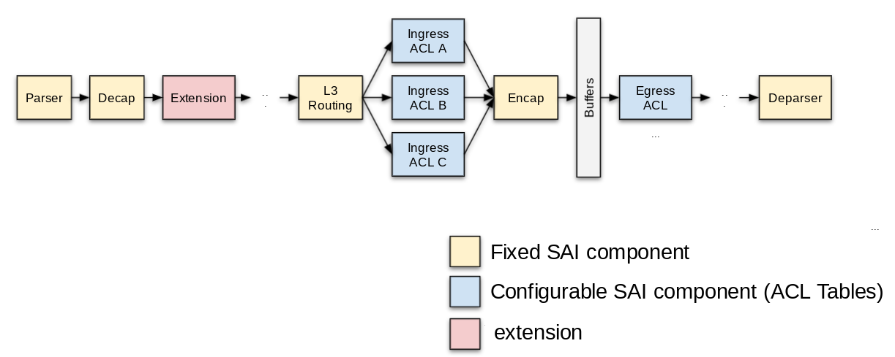
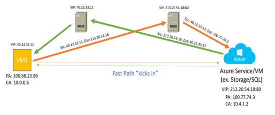
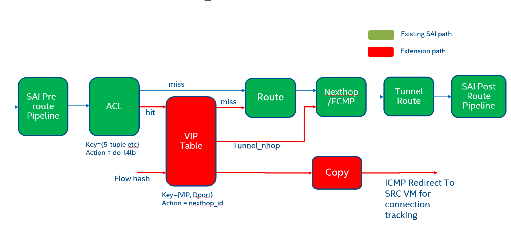

SAI Generic Extensions API Proposal
===================================

Title       | SAI Generic Extensions Proposal
------------|--------------------------------
Authors     | Intel.
Status      | Draft
Type        | Standards track
Created     | 07/15/2022
SAI-Version | 1.11
---------------------------------------------

## Table of Contents
- [Scope](#scope)
- [Overview](#overview)
  - [sai_json_t](#saijsont)
  - [SAI_OBJECT_TYPE_GENERIC_PROGRAMMABLE](#saiobjecttypegenericprogrammable)
- [SAI pipeline](#sai-pipeline)
- [An Example - L4LB](#an-example---l4lb)
  - [JSON data](#json-data)
  - [References between 2 programmable blocks](#references-between-2-programmable-blocks)
  - [Counters](#counters)
  - [CRM](#crm)
- [API specification](#api-specification)
  - [New header file saigenericextensions.h](#new-header-file-saigenericextensionsh)
- [API usage](#api-usage)
  - [Create](#create)
  - [Update](#update)
  - [Delete](#delete)
  - [Object Query](#object-query)
  - [CRM API](#crm-usage)
- [Usage Examples for sai_json_t](#usage-examples-for-saijsont)
  - [Refer to an OID - Port](#refer-to-an-oid---port)
  - [Refer to an OID - Port](#refer-to-an-oid---generic-programmable-block)
  - [Refer to a key based object - Route](#refer-to-a-key-based-object---route)

# Scope #
This document defines the technical specification for the API used to support SAI Extensions. Extensions can be seen as an abstraction over niche/device-specific features. They facilitate the configuration of newly supported features of ASICs via the familiar SAI API model. The exact feature enabled via the extensions itself is outside the scope of this document but an example is provided below to better explain this feature. These extensions are not a replacement to the existing SAI objects but instead provide a complementary path to achieve the goals set out below.

# Overview #
SAI Generic extensions introduce a new SAI object SAI_OBJECT_TYPE_GENERIC_PROGRAMMABLE of object_type_oid. This new object uses a single attribute of type sai_json_t defined in this proposal. This object and its attribute provide an abstraction of target-specific configurable features otherwise not described in SAI. This new object enables the 
- Support ability to add user features
- Support device-specific capabilities
- Rapid application prototyping

The purpose of this document is to introduce these new entities and how they can be leveraged to extend data plane functionality.
1. sai_json_t - New SAI datatype 
2. SAI_OBJECT_TYPE_GENERIC_PROGRAMMABLE - New SAI object type

## sai_json_t ##
sai_json_t defines a generic data type using JSON as the data format with a predefined grammar allowed to be used within. This grammar allows validators like SAI metadata to verify data and corresponding types accurately. The user of this data type copies a JSON string into this type. The exact structure or content of the API is opaque and is considered an agreed contract between the application and SAI implementation.

```c
/**
 * @brief
\verbatim
"attributes": [
    {
        <attribute_name>: {
            "sai_metadata": {
                "sai_attr_value_type": "<SAI_ATTR_VALUE_TYPE_T>",
                "brief": "Brief Attribute Description",
                "sai_attr_flags": "<SAI_ATTR_FLAGS_T>",
                "allowed_object_types": [ "<LIST OF ALLOWED OBJECT TYPES>" ],
                "default_value": "<DEFAULT ATTR VALUE>"
            },
            "value": <VALUE of the attribute>
        }
    }
]
\endverbatim
 * "attributes" : Mandatory top-level key where JSON parsing begins
 * "<attribute_name>" : Name of one attribute in the list of attributes
 * "sai_attr_value_type" : Data type of the attribute
 * "brief" : Optional description of the field
 * "sai_attr_flags" : Optional Usage flags for the field
 * "allowed_object_types" : If data type is OID, then this is the list of object types allowed as data
 */
typedef struct _sai_json_t {

    /** string in JSON format */
    sai_s8_list_t json;
} sai_json_t;
```

## SAI_OBJECT_TYPE_GENERIC_PROGRAMMABLE ##

### Description ###
- object_name
  - This node is used as a demultiplexing mechanism to refer to different HW blocks. This name can be either a string or an integer which simply identifies a unique HW block in an ASIC. It is left to the SAI implementation how this field is used to demultiplex the data.
- attributes
  - This node is a list of fields describing a set of attributes that carry the data required to program the HW block.

```c
/**
 * @brief Attribute Id for Generic Programmable extension */
typedef enum _sai_generic_programmable_entry_attr_t
{
    /**
     * @brief Start of attributes
     */
    SAI_GENERIC_PROGRAMMABLE_ATTR_START,


    /**
     * @brief HW block name to program the entry
     *
     * @type sai_s8_list_t
     * @flags MANDATORY_ON_CREATE | CREATE_ONLY
     * @default empty
     */
    SAI_GENERIC_PROGRAMMABLE_ATTR_OBJECT_NAME = SAI_GENERIC_PROGRAMMABLE_ATTR_START,

    /**
     * @brief JSON string carrying HW block entry information
     *
     * @type sai_json_t
     * @flags CREATE_AND_SET
     * @default empty
     */
    SAI_GENERIC_PROGRAMMABLE_ATTR_ENTRY,

    /**
     * @brief End of attributes
     */
    SAI_GENERIC_PROGRAMMABLE_ATTR_END,

    /** Custom range base value */
    SAI_GENERIC_PROGRAMMABLE_ATTR_CUSTOM_RANGE_START = 0x10000000,

    /** End of custom range base */
    SAI_GENERIC_PROGRAMMABLE_ATTR_CUSTOM_RANGE_END

} sai_generic_programmable_entry_attr_t;
```

# SAI Pipeline #
The following diagram describes a SAI pipeline with various HW blocks. The yellow boxes indicate fixed HW blocks which are typically not modifiable. The blue boxes indicate runtime modifiable blocks like ACLs or some other stateful entities. Both the yellow and blue boxes are today described in SAI and their programming semantics are well established. The red boxes indicate new extensions to the pipeline which are the subject of this proposal.



## An Example - L4LB ##
The API usage is explained via an example. The example chosen is L4 Load Balancer. The following steps summarize the operation of the HW block.




- Hybrid architecture where the initial load-balancing decision is taken at the switch and connection tracking is implemented at the edge (NIC/Appliance etc)
- Switch will advertise VIP through routing protocols in order to attract initial packet(s) to the switch.
- Once the switch receives the first packet (SYN), it will choose one of the backends from a pool, encapsulate the packet with the appropriate tunnel header and route the packet based on destination IP in the tunnel header.
- Switch will also send a copy (ICMP response) of the packet to the source VM so a flow entry can be installed there.
- Once a flow has been established, subsequent packets of the flow will be sent directly from the source VM to the destination VM.

From an application standpoint, 
- It will push a VIP and the corresponding DIP pool to the DUT modeled below by the VIP table in the red block. 
- Use an ACL table to filter flows that are allowed to be load-balanced 
- The encap information can be provided by either passing in DIP list directly and leave the nexthop resolution to the SAI implementation or by explicitly passing the Tunnel nexthop IDs as the DIP pool.



## JSON data ##
The following example is the actual data that flows down the software stack. Note that this format adheres to the grammar specified in the definition of sai_json_t.
The JSON data includes the actual value and the associated metadata describing the attribute.
```json
"attributes": [
    {
        "virtual_ip": {
            "sai_metadata": {
                "sai_attr_value_type": "SAI_ATTR_VALUE_TYPE_IP_ADDRESS"
            },
            "value": "10.1.1.1"
        }
    },
    {
        "nexthop_list": {
            "sai_metadata": {
                "sai_attr_value_type": "SAI_ATTR_VALUE_TYPE_OBJECT_LIST"
            },
            "value": [ "0x1500000000001fa", "0x1500000000001fb" ]
        }
    }
]
```

## SAI ACL considerations ##
The new VIP table is conditionally evaluated based on policies in the ACL tables. This requires a new action type in saiacl.h.
SAI ACL action type is today exposed via 2 mechanisms. * sai_acl_action_type_t - This type is only used today to query the SAI ACL action capabilities * SAI_ACL_ENTRY_ATTR_ACTION_START/END - An attribute specifiying the ACL action type for an entry
While there are multiple mechanisms to extend these, one recommendation is as below. 
- Extend sai_acl_acion_type_t with a custom range just like all the attribute enums for SAI objects 
  - SAI_ACL_ACTION_TYPE_CUSTOM_RANGE 
  - SAI_ACL_ACTION_TYPE_DO_LB = SAI_ACL_ACTION_TYPE_CUSTOM_RANGE + 1 
- Add a new custom attribute. This attribute essentially acts as an input into the new VIP table filtering packets. 
```c
    /**
     * @brief Apply vip table
     *
     * @type boolean
     * @flags CREATE_AND_SET
     * @default false
     */
   SAI_ACL_ENTRY_ACTION_DO_LB = SAI_ACL_ENTRY_ACTION_CUSTOM_RANGE + 1
```

## Why is metadata required? ##
1. Data validation for intermediate SW layers. sonic-sairedis in the SONiC operating system is an example. The meta infra can understand the object types from the JSON data type and perform the relevant validations.
2. Reference counting. The OID on its own can just be a sequentially incrementing integer and does not hold any context. The additional metadata provides the context to allow an application to perform operations like reference counting, object references, etc.

## Counters ##
Counters in SAI use 2 patterns.
- Counters are retrieved using the objects OID and call the associated get_stats() API. sai_get_vlan_stats_fn for SAI_OBJECT_TYPE_VLAN is an example.
- Counters are retrieved by attaching an explicit counter object to an attribute of the object counters are associated with. SAI_ACL_ENTRY_ATTR_ACTION_COUNTER is used to attach a SAI_OBJECT_TYPE_ACL_COUNTER object. The stats are then obtained by calling sai_get_acl_counter_attribute_fn.

TBD: Use one of the above patterns to retrieve counters based on feedback

## CRM ##
Table availability and other characteristics can be queried similarly to how the rest of the SAI objects work. sai_object_type_get_availability() allows passing sai_json_t type with the object_name encoded in the attribute list.

# API Specification #

## New header file saigenericextensions.h ##
The new header file defines interfaces for a single object of type SAI_OBJECT_TYPE_GENERIC_PROGRAMMABLE.

This new object mimics an entry in a HW block. An ASIC can expose multiple tables or HW blocks via the generic extensions. Each HW block is referred to by the “object_name” node in the “sai_json_t” type. Using this mechanism, the application can use a single object type to refer to more than one HW block.

Please refer to the API usage section for more information.

The below APIs look similar to other SAI objects CRUD semantics.

## SAI Generic Programmable Extension APIs ##
```c
/**
 * @brief Create a Generic programmable entry
 *
 * @param[out] generic_programmable_id The OID returned per entry per HW block
 * @param[in] switch_id The Switch Object id
 * @param[in] attr_count Number of attributes
 * @param[in] attr_list Array of attributes
 *
 * @return #SAI_STATUS_SUCCESS on success, failure status code on error
 */
typedef sai_status_t (*sai_create_generic_programmable_fn)(
        _Out_ sai_object_id_t *generic_programmable_id,
        _In_ sai_object_id_t switch_id,
        _In_ uint32_t attr_count,
        _In_ const sai_attribute_t *attr_list);

/**
 * @brief Delete a Generic programmable entry
 *
 * @param[in] generic_programmable_id The table id
 *
 * @return #SAI_STATUS_SUCCESS on success, failure status code on error
 */
typedef sai_status_t (*sai_remove_generic_programmable_fn)(
        _In_ sai_object_id_t generic_programmable_id);

/**
 * @brief Set Generic programmable Table entry attribute
 *
 * @param[in] generic_programmable_id The table id
 * @param[in] attr Attribute
 *
 * @return #SAI_STATUS_SUCCESS on success, failure status code on error
 */
typedef sai_status_t (*sai_set_generic_programmable_attribute_fn)(
        _In_ sai_object_id_t generic_programmable_id,
        _In_ const sai_attribute_t *attr);

/**
 * @brief Get Generic programmable entry attribute
 *
 * @param[in] generic_programmable_id The table id
 * @param[in] attr_count Number of attributes
 * @param[inout] attr_list Array of attributes
 *
 * @return #SAI_STATUS_SUCCESS on success, failure status code on error
 */
typedef sai_status_t (*sai_get_generic_programmable_attribute_fn)(
        _In_ sai_object_id_t generic_programmable_id,
        _In_ uint32_t attr_count,
        _Inout_ sai_attribute_t *attr_list);

/**
 * @brief Generic extensions methods table retrieved with sai_api_query()
 **/
typedef struct _sai_generic_programmable_api_t
{
    sai_create_generic_programmable_fn            create_generic_programmable;
    sai_remove_generic_programmable_fn            remove_generic_programmable;
    sai_set_generic_programmable_attribute_fn     set_generic_programmable_attribute;
    sai_get_generic_programmable_attribute_fn     get_generic_programmable_attribute;
} sai_generic_programmable_api_t;
```

# API usage #

## Create ##

### APP DB Entry ### 
```
127.0.0.1:6379> HGETALL "VIP_TABLE:10.1.1.1"
1) "nexthop_list"
2) "10.0.0.57,10.0.0.59"
3) "ifname"
4) "Ethernet0, Ethernet1"
```
Sample code 
```c
sai_attribute_t attr;
vector<sai_attribute_t> attrs;
 
// set object name
std::string object_name = “vip_table”;
attr.id = SAI_GENERIC_PROGRAMMABLE_ATTR_OBJECT_NAME;
auto size = sizeof(attr.value.chardata);
strncpy(attr.value.chardata, object_name.c_str(), size - 1);
attr.value.chardata[size - 1] = '\0';
attrs.push_back(attr);
 
// encode the JSON info for VIP table
nlohmann::json json;
 
// push metadata and value for virtual_ip
nlohmann::json sai_metadata_json;
sai_metadata_json[“sai_metadata”][“sai_attr_value_type”] = SAI_ATTR_VALUE_TYPE_IP_ADDRESS;
nlohmann::json virtual_ip;
virtual_ip[“virtual_ip”][“value”] = “10.1.1.1”;
virtual_ip[“virtual_ip”][“sai_metadata”] = sai_metadata_json.dump();
json.push_back(virtual_ip);
 
// push metadata and value for nexthop_list
nlohmann::json sai_metadata_json;
sai_metadata_json[“sai_metadata”][“sai_attr_value_type”] = SAI_ATTR_VALUE_TYPE_OBJECT_ID;
sai_metadata_json[“sai_metadata”][“allowed_object_types”] =
    { SAI_OBJECT_TYPE_NEXTHOP };
nlohmann::json nexthop_list;
nexthop_list [“nexthop_list”][“value”] = { nexthop_1_oid, nexthop_2_iod };
nexthop_list [“nexthop_list”][“sai_metadata”] = sai_metadata_json.dump();
json.push_back(nexthop_list);
 
attr.id = SAI_GENERIC_PROGRAMMABLE_ATTR_ENTRY;
strncpy(attr.data.json, json.dump(), sizeof(json.dump());
attrs.push_back(attr);
 
sai_object_id_t sai_generic_oid;
sai_status_t status =
    sai_generic_programmable_api->create_generic_programmable(
        &sai_generic_oid, gSwitchId, (uint32_t)attrs.size(), attrs.data());
```

## Update ##
Does update require the entire list of JSON attributes populated or just the attribute requiring update?

FOR all attributes
- Ease of programming for application
- Application is not required to group attributes for a single update

AGAINST all attributes
- SAI implementation has to update all attributes even if that is not the intention
- May result in unnecessary HW updates
- Goes against the SAI API semantics for attribute update
- May lead to performance degradation for updates

## Delete ##
Delete requires no special information since the object is OID based. Just passing the OID should be sufficient to clear the entry.

## Object Query ##
The list of all generic programmable objects can be queried using the existing saiobject.h infrastructure in SAI.

## CRM usage ##
```c
sai_attribute_t attr;
vector<sai_attribute_t> attrs;
 
// set object name
std::string object_name = “vip_table”;
attr.id = SAI_GENERIC_PROGRAMMABLE_ATTR_OBJECT_NAME;
auto size = sizeof(attr.value.chardata);
strncpy(attr.value.chardata, object_name.c_str(), size - 1);
attr.value.chardata[size - 1] = '\0';
attrs.push_back(attr);
 
uint64_t count = 0;
sai_status_t status =
    sai_object_type_get_availability(gSwitchId,
                                     SAI_OBJECT_TYPE_GENERIC_PROGRAMMABLE,
                                     (uint32_t)attrs.size(),
                                     attrs.data(),
                                     &count);
```

# Usage Examples for sai_json_t #
## Refer to an OID - Port ##
```json
{
    "port_ref": {
        "sai_metadata": {
            "sai_attr_value_type": "SAI_ATTR_VALUE_TYPE_OBJECT_ID",
            "allowed_object_types": ["SAI_OBJECT_TYPE_PORT"]
        },
        "value": "0x15000000000ffc"
    }
}
```

## Refer to an OID - Generic programmable block ##
The sai_json_t type can include references to other SAI extension blocks. It is allowed to pass the new object type as a reference in the JSON like any other SAI object.
```json
{
    "object_id": {
        "sai_metadata": {
            "sai_attr_value_type": "SAI_ATTR_VALUE_TYPE_OBJECT_ID",
            "allowed_object_types": ["SAI_OBJECT_TYPE_GENERIC_PROGRAMMABLE"]
        },
        "value": "0x150000000008ba"
    }
}
```

## Refer to a key based object - Route ##
```json
"attributes": [
    {
        "route_ip": {
            "sai_metadata": {
                "sai_attr_value_type": "SAI_ATTR_VALUE_TYPE_IP_PREFIX"
            },
            "value": "10.1.1.1/24"
        },
        "route_vrf": {
            "sai_metadata": {
                "sai_attr_value_type": "SAI_ATTR_VALUE_TYPE_OBJECT_ID",
                "allowed_object_types": ["SAI_OBJECT_TYPE_VIRTUAL_ROUTER"]
            },
            "value": "0x15000000000fdec"
        }
    }
]
```

